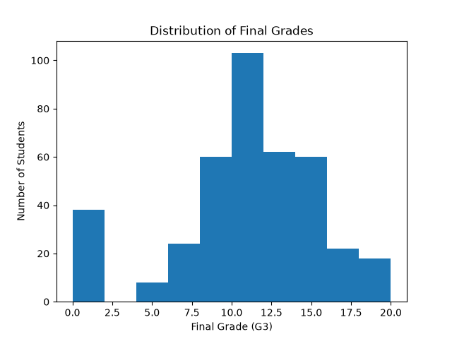
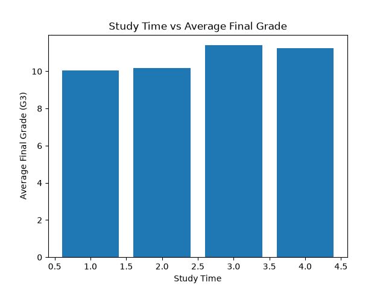
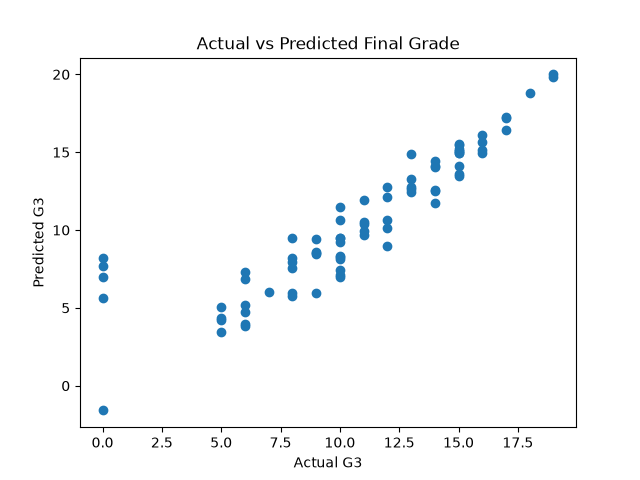

# Student Performance Prediction using Python and Machine Learning

A machine learning project that analyzes student performance data and predicts students' final grades using Python and Linear Regression.

## 📌 Project Overview

This project uses the UCI Student Performance dataset to study the factors that may be related to students' academic performance. Exploratory Data Analysis (EDA) and data visualization were performed to understand relationships between different student attributes and final grades.

A Linear Regression model was then trained to predict the final grade (G3) using selected features.

## 🎯 Objectives

* Analyze student performance data using Python.
* Perform Exploratory Data Analysis (EDA).
* Visualize important relationships in the dataset.
* Identify suitable features for machine learning.
* Train a Linear Regression model.
* Predict students' final grades.
* Evaluate the performance of the trained model.

## 📊 Dataset

The project uses the **UCI Student Performance Dataset**.

* Number of student records: **395**
* Number of attributes: **33**
* Target variable: **G3 (Final Grade)**
* Final grade range: **0–20**
* Missing values: **0**

The dataset contains information related to students' demographics, study habits, previous grades, absences, family background and other student-related characteristics.

## 🛠️ Technologies Used

* Python
* Pandas
* NumPy
* Matplotlib
* Scikit-learn
* Jupyter/VS Code

## 🔍 Exploratory Data Analysis

Several visualizations were created to understand the dataset, including:

* Final Grade Distribution
* Study Time vs Final Grade
* Absences vs Final Grade
* Gender vs Final Grade
* Sex vs Final Grade
* Age vs Final Grade
* Failures vs Final Grade
* Study Time vs Absences
* Study Time vs Failures
* Actual vs Predicted Final Grade

## 🤖 Machine Learning Model

**Algorithm:** Linear Regression

The dataset was divided into training and testing data. The model was trained using selected features and then used to predict the final grades of students in the test dataset.

## 📈 Model Evaluation

The trained model achieved approximately:

* **Mean Absolute Error (MAE): 1.31**
* **R² Score: 0.80**

These results indicate that the model provides reasonably accurate predictions of students' final grades using the selected features.

## 📁 Project Structure

```text
student-performance-prediction-ml/
│
├── main.py
├── student-mat.csv
├── student_performance_model.pkl
│
├── grade_distribution.png
├── studytime_vs_grade.png
├── studytime_vs_absences.png
├── studytime_vs_failures.png
├── absences_vs_grade.png
├── age_vs_grade.png
├── failures_vs_grade.png
├── gender_vs_grade.png
├── sex_vs_grade.png
├── actual_vs_predicted.png
│
└── README.md
```

## ▶️ How to Run

1. Clone or download this repository.
2. Install the required Python libraries.
3. Run the following command:

```bash
python main.py
```

The program loads the dataset, performs analysis, trains the Linear Regression model and generates predictions.

## 📌 Future Scope

* Compare multiple machine learning algorithms.
* Perform hyperparameter tuning and cross-validation.
* Use additional student-related features.
* Improve prediction accuracy.
* Develop a simple application for student performance prediction.

## 👨‍💻 Author

**Ashutosh Raghav**

B.Tech CSE
Gurugram University

## 📊 Visualizations

### Final Grade Distribution


### Study Time vs Final Grade


### Actual vs Predicted Final Grades

